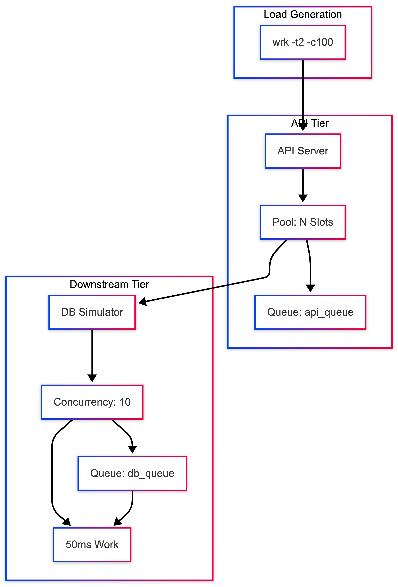

# My Experiments With Code

Experiments to understand various concepts in detail.

## Downstream Saturation Safe Mitigation
This is a hands-on demonstration of how queueing creates tail latency in distributed systems. Through a minimal API→DB setup, you'll learn:

- Why p99 latency explodes under load (queueing, not slow code)
- How increasing connection pools helps until downstream saturates
- Where bottlenecks actually form in layered architectures
- How to diagnose queue depth using latency distributions
- The "knee" point of diminishing returns for capacity

### Architecture Diagram



### Quick Start

1. Clone and setup

```shell
git clone https://github.com/ani03sha/my-experiments-with-code.git
cd downstream_saturation_safe_mitigation
npm install  # If using package.json
```

2. Start the DB simulator

```shell
node db_simulator.js
# Default: 10 concurrent, 50ms work
# Customize: DB_CONC=5 WORK_MS=100 node db_simulator.js
```

3. Start the API server

```shell
# Small pool (creates API bottleneck)
POOL_SIZE=2 node api_server.js

# Larger pool (moves bottleneck downstream)
POOL_SIZE=20 node api_server.js

# With circuit breaker protection
POOL_SIZE=20 CB_ENABLED=1 node api_server.js
```

4. Run load tests

```shell
# Quick test
wrk -t2 -c100 -d5s --latency http://localhost:3000/work

# Full test with timeout buffer
wrk -t2 -c100 -d10s --timeout 30s --latency http://localhost:3000/work
```

5. View metrics

```shell
# API metrics
curl http://localhost:3000/metrics

# DB metrics
curl http://localhost:5001/metrics

# Health checks
curl http://localhost:3000/health
curl http://localhost:5001/health
```

### Understanding the results

**Expected Patterns**

- POOL_SIZE=2 (API Bottleneck):

```plaintext
RPS: ~37, p99: ~2.0s
API queue: ~98, DB queue: 0
Only 2 concurrent requests → 98 wait in line
```

- POOL_SIZE=10 (Matched Capacity):

```plaintext
RPS: ~190, p99: ~520ms  
API queue: ~90, DB queue: 0
Max throughput reached, but queues still form
```

- POOL_SIZE=50 (Over-provisioned):

```plaintext
RPS: ~190, p99: ~520ms
API queue: ~40, DB queue: ~40
Queue distributes across layers - no throughput gain
```

## Retry Storm Load Amplification

> **"Retries aren't free. Each retry adds load. Too many retries = retry storm = system collapse."**

A hands-on demonstration of how naive retry logic causes cascading failures in distributed systems, and how simple fixes prevent disasters.

### The Problem

Retry storms happen because of a **positive feedback loop**:

1. Downstream service gets slow (5% of requests take 1000ms)
2. Client timeouts fire (100ms timeout)
3. Clients retry immediately
4. **More retries = more load on downstream**
5. **More load = more slow requests**
6. **More slow requests = more timeouts = more retries**
7. **System collapses**

### Quick Start

```bash
# Install dependencies
npm install

# Run the experiment (requires wrk load testing tool)
./run_all_scenarios.sh
```

### Expected Results

```
Scenario             |    Retries |      Queue
---------------------|------------|-----------
Baseline             |          0 |          7
Naive Retries        |        415 |          9
Retry Storm          |       1645 |        115  ⚠️ DISASTER
Backoff+Jitter       |        238 |          7  ✅ 43% better
Lower Max Retries    |        520 |         10
```

#### What This Shows

- **Baseline (no retries)**: Natural queue buildup from slow requests
- **Naive Retries**: 3 retries with immediate retry → 415 total retries
- **Retry Storm**: 5 retries + 50ms timeout → **1645 retries, 115 queue depth** 🔥
- **Backoff+Jitter**: Same 3 retries but with exponential backoff + jitter → 43% fewer retries
- **Lower Max Retries**: Just 2 retries instead of 3 → Still problematic without backoff

### The Key Insight

#### Load Amplification Formula

```
Effective QPS = Incoming QPS × (1 + Average Retries)
```

If you have 100 req/s with 3 retries on 10% of requests:
```
100 req/s × (1 + 0.3) = 130 req/s on downstream
```

But with a retry storm, this becomes exponential:
```
100 req/s × (1 + 16 retries) = 1700 req/s 🔥
```

### Why Tail Latency Explodes First

- **95% of requests** finish fast (50ms)
- **5% are slow** (1000ms) - get queued
- **Retries hit the slow path again**
- **Queue grows** → latency compounds
- **p99 goes vertical while p50 looks fine**

Your users see timeouts while dashboards show "healthy".

### The Fixes

#### 1. Exponential Backoff

Wait longer between retries:
- 1st retry: 50ms
- 2nd retry: 100ms
- 3rd retry: 200ms

```javascript
// api_server.js:138
const baseDelay = 50;
let delay = Math.min(1000, baseDelay * Math.pow(2, attempt - 1));
```

#### 2. Jitter

Add ±50% randomness to prevent "thundering herd":

```javascript
// api_server.js:141
if (JITTER) {
  delay = delay * (0.5 + Math.random());
}
```

#### 3. Bound Retry Counts

Never use unlimited retries. Max 2-3 retries:

```javascript
// api_server.js:10
const RETRIES = 3; // Not 5, not 10, definitely not infinite
```

### Architecture

#### Downstream Service (`downstream.js`)

Simulates a realistic backend:
- **Concurrency limit**: 10 max concurrent requests
- **Fast path**: 50ms latency (95% of requests)
- **Slow path**: 1000ms latency (5% of requests)
- **Error rate**: 1% random errors
- **Queue behavior**: Wait time compounds with queue depth

#### API Server (`api_server.js`)

Configurable retry behavior:
- `RETRIES`: Max retry attempts
- `TIMEOUT_MS`: Request timeout
- `EXP_BACKOFF`: Enable exponential backoff
- `JITTER`: Enable jitter
- `RETRY_BUDGET`: Max retries per second (optional)

#### Load Testing

Uses `wrk` to generate realistic load:
- 2 threads
- 10 concurrent connections
- 10 second test duration per scenario

### How to Run Individual Scenarios

#### Baseline (No Retries)
```bash
./run_baseline.sh
```

#### Naive Retries (3 retries, no backoff)
```bash
RETRIES=3 TIMEOUT_MS=100 node api_server.js &
node downstream.js &
wrk -t2 -c10 -d10s http://localhost:3000/api
```

#### Retry Storm (5 retries, 50ms timeout)
```bash
RETRIES=5 TIMEOUT_MS=50 node api_server.js &
node downstream.js &
wrk -t2 -c10 -d10s http://localhost:3000/api
```

#### Backoff + Jitter (Safe Retries)
```bash
RETRIES=3 TIMEOUT_MS=100 EXP_BACKOFF=true JITTER=true node api_server.js &
node downstream.js &
wrk -t2 -c10 -d10s http://localhost:3000/api
```

### Production Rules

1. **Always bound retry counts** - Max 2-3 retries
2. **Always use exponential backoff** - 50ms, 100ms, 200ms, 400ms...
3. **Always add jitter** - Prevents synchronized retries
4. **Align timeouts with SLOs** - timeout = p99 latency + buffer
5. **Monitor retry rates** - Alert when retry rate > 10%

### The "Aha!" Moment

When you see the retry storm scenario:

- **1645 retries** from just a 5% slow rate
- **115 queue depth** from compounding delays
- **System thrashing** instead of serving requests

Compare to backoff+jitter:
- **238 retries** (85% reduction!)
- **7 queue depth** (93% reduction!)
- **System stable** and recovering

**That's the power of simple fixes.**

**Bottom line**: Never "just add retries." Always bound, backoff, and budget. Retries are necessary but dangerous. Handle with care.

## Autoscaling, Load Shedding, Graceful Degradation

A reproducible local demo showing how autoscaling, load-shedding, and graceful degradation work together to maintain SLOs under bursty traffic.

### Overview

This demo simulates a production-like system experiencing sudden traffic bursts. It demonstrates three resilience patterns:

1. **Autoscaling**: Automatically adds instances when latency degrades
2. **Load Shedding**: Rejects requests when capacity is exceeded
3. **Graceful Degradation**: Returns cached/simplified responses instead of errors

### Architecture

```plaintext
wrk (load generator)
  ↓
Dispatcher (port 8080)
  ↓ (round-robin)
API Instances (ports 3000+)
  ↓
DB Simulator (port 3001) [optional]

Autoscaler (monitors port 8080, controls scaling)
```

### Quick Start

Run the combined demo (recommended):

```bash
./run_scale_then_shed.sh
```

This will:
1. Start dispatcher with 1 instance
2. Start autoscaler
3. Apply burst load
4. Show autoscaling reaction
5. Demonstrate load shedding as safety net
6. Generate metrics for analysis

### Running Tests

#### Test 1: Baseline Burst (No Protection)

```bash
./run_burst.sh
```

**Expected Outcome**: Single instance overwhelmed, high p99 latency, queue depth spikes.

**What to capture**:
```bash
cat baseline_burst.txt | grep "Latency Distribution" -A 4
# Copy: p50, p95, p99 values
cat baseline_burst.txt | grep "Requests/sec"
# Copy: throughput
```

#### Test 2: Load Shedding Only

```bash
./run_noscale_shed.sh
```

**Expected Outcome**: Some requests shed (503), but successful requests maintain SLO.

**What to capture**:
```bash
cat after_noscale.json | jq '.api_instances[0] | {
  shed_count: .api_shed_count,
  p95: .p95_estimate,
  queue: .api_queue
}'
```

#### Test 3: Autoscaling + Load Shedding

```bash
./run_scale_then_shed.sh
```

**Expected Outcome**: Instance count increases, shed rate decreases, p95 recovers.

**What to capture**:
```bash
# Before
cat before_combined.json | jq '{instances: .dispatcher.dispatcher_active_instances, p95: .dispatcher.p95_estimate}'

# After
cat after_combined.json | jq '{instances: .dispatcher.dispatcher_active_instances, p95: .dispatcher.p95_estimate, total_shed: [.api_instances[].api_shed_count] | add}'

# Scaling events
cat after_combined.json | jq '.autoscaler.scale_history'
```

#### Test 4: Parameter Sweep

```bash
./sweep_scale.sh
```

Tests different combinations of:
- Scale reaction time (fast: 3s, slow: 10s)
- Shed threshold (low: 5, medium: 10, high: 15)

**What to capture**:
```bash
cat sweep_results_*/summary.csv | column -t -s','
```

## Safe Schema Migration With Backfills

Zero-downtime schema migration demo using the expand → backfill → contract pattern.

### Prerequisites

- Docker & Docker Compose
- Node.js 18+
- `jq` for JSON parsing

### Setup

```bash
npm install
docker-compose up -d
```

### Run Migration Phases

Execute in order:

```bash
bash run_baseline.sh      # Initialize DB + baseline traffic (60s)
bash run_expand.sh         # Add nullable column (30s)
bash run_backfill.sh       # Backfill with live traffic (2 mins)
bash run_contract.sh       # Drop old columns (30s)
```

### Validate

```bash
bash collect_validation.sh  # Check migration completeness
```

### Rollback Demo

```bash
bash run_rollback.sh       # Simulates failed backfill + recovery
```

### Key Files

- `app_v1.js` - Original schema (first_name, last_name)
- `app_v2.js` - New schema (full_name) with dual-write mode
- `backfill.js` - Idempotent chunked backfill
- `traffic_generator.js` - Concurrent load simulator

### Expected Outcome

All phases complete with zero errors. Final state: 100% users migrated to `full_name` column.

## Chaos Engineering with Automated Remediation Demo

A compact, deterministic, reproducible demo that demonstrates chaos engineering experiments combined with automated remediation to protect SLOs.

### Architecture

```
wrk -> dispatcher -> [ N x API instances ] -> db_sim
           |                     ^
           |---- remediator ---->|
```

- **Dispatcher**: Local load balancer that round-robins to active API instances and exposes metrics
- **API Instances**: Handle work requests with configurable pool size, degrade mode, and chaos modes
- **DB Simulator**: Simple fast DB simulator with low latency
- **Chaos Controller**: Deterministic fault injector (latency, errors, instance kill)
- **Remediator**: Polls metrics and executes remediation actions based on SLO rules

### Quick Start
```bash
# Run baseline test (20 seconds)
./run_baseline.sh

# Run chaos experiments (60 seconds each)
./run_chaos_latency.sh  # Inject latency on one instance
./run_chaos_error.sh    # Inject error responses
./run_chaos_kill.sh     # Kill an instance
```

### Run Scripts

#### run_baseline.sh
Starts 2 API instances, dispatcher, and DB simulator. Runs baseline load test:
```bash
wrk -t4 -c200 -d20s --latency http://localhost:8080/work
```
Output saved to `baseline.txt`.

#### run_chaos_latency.sh
Injects 200ms latency on instance-1 after 10 seconds for 20 seconds. Remediator monitors and may restart/scale. Runs:
```bash
wrk -t8 -c400 -d60s --latency http://localhost:8080/work
```
Output saved to `during_latency.txt`.

#### run_chaos_error.sh
Injects 50% error rate on instance-1 after 10 seconds for 20 seconds. Remediator may enable degrade mode. Same wrk command, output to `during_error.txt`.

#### run_chaos_kill.sh
Kills instance-1 after 10 seconds. Remediator detects and should restart. Same wrk command, output to `during_kill.txt`.

#### collect_metrics.sh
Samples `/metrics` endpoints every 5 seconds and stores snapshots to files.

## Cache Stampede Demo

A compact, deterministic, reproducible demonstration of cache behavior under load, specifically showing:
- Cache misses
- Cache stampedes
- Mitigation strategies (singleflight / request coalescing, negative caching)

### Quickstart

```bash
npm install
./run_all_tests.sh    # Runs all tests (~2-3 min)
./analyze_results.sh  # View formatted comparison
```

That's it! You will see how caching can make systems **worse** under load, and how to fix it.

### What This Demonstrates

This project teaches three critical lessons about caching systems:

1. **Naive caching can make systems worse under load** - When cache entries expire synchronously, all concurrent requests rush to the database, creating a stampede that overwhelms downstream systems.

2. **Cache misses amplify downstream load and explode p99 latency** - A single cache miss under high concurrency can trigger hundreds of simultaneous database calls, causing tail latency to spike dramatically.

3. **Proper mitigation patterns stabilize latency and protect downstreams** - Techniques like singleflight (request coalescing), TTL jitter, and negative caching prevent stampedes and keep systems stable even under extreme load.

### Architecture

```
wrk (load generator)
  ↓
API Service (Express on port 3000)
  ↓
In-memory Cache (TTL-based)
  ↓
Downstream DB Simulator (port 3001, max 20 concurrent, 50ms latency)
```

The cache is inside the API process (simple in-memory Map with TTL).

**DB Simulator Configuration:**
- Concurrency limit: 20 simultaneous requests (controlled by semaphore)
- Latency per request: 50ms
- This creates realistic backpressure to demonstrate cache benefits

### Cache Modes

The API server supports four cache modes (via `CACHE` environment variable):

- `off` - No caching, all requests go directly to DB
- `naive` - Simple TTL-based cache, susceptible to stampedes
- `singleflight` - Request coalescing: only one in-flight DB call per key
- `negative` - Singleflight + negative caching for errors (short TTL)

### Run All Tests Automatically

The easiest way to see all demonstrations:

```bash
./run_all_tests.sh
```

This script:
- Runs all 5 tests sequentially (no-cache, naive, stampede, singleflight, negative)
- Collects and analyzes results automatically
- Generates a comprehensive summary with:
  - Performance comparison table
  - Key findings and observations
  - Production recommendations
- Takes ~2-3 minutes total
- Saves summary to `results/summary_TIMESTAMP.txt`

**All test scripts automatically save their output to the `results/` directory with timestamps.**

### Run Individual Tests

Each script demonstrates a different caching behavior:

#### 1. No Cache Baseline
```bash
./run_no_cache.sh
```
Expected: Stable but slow (p50: ~50-70ms, p99: ~100-150ms). All requests hit the database. Downstream load proportional to QPS.
Note: Uses 100 concurrent connections to avoid overwhelming the uncached system.

#### 2. Naive Cache
```bash
./run_naive_cache.sh
```
Expected: Good steady-state performance when cache is hot, but catastrophic p99 spike when TTL expires and cache entries synchronize.

#### 3. Cache Stampede (Intentional)
```bash
./run_stampede.sh
```
Expected: Dramatic demonstration of stampede behavior. Sudden surge in `downstream_calls` and `db_queue`, p99 latency spikes.
Duration: ~20 seconds (faster than before)

#### 4. Singleflight Protection
```bash
./run_singleflight.sh
```
Expected: `downstream_calls` capped at ~1 per key despite high concurrency. P99 stabilizes even during TTL expiry.

#### 5. Negative Caching
```bash
./run_negative_cache.sh
```
Expected: During error bursts, repeated failures don't amplify load. Short-TTL error caching prevents downstream from being hammered.

### Analyzing Test Results

#### Quick Comparison (Stampede vs Singleflight)

For a focused comparison showing the core problem and solution:

```bash
./compare_stampede_vs_singleflight.sh
```

This generates a side-by-side comparison:
- Shows the dramatic difference in downstream DB calls
- Highlights p99 latency improvement
- Explains the singleflight mechanism
- Perfect for screenshots/demos

#### Full Analysis (All Tests)

After running tests, use the analyzer to get a comprehensive formatted comparison:

```bash
./analyze_results.sh
```

This generates:
- **Detailed metrics table** with p50/p95/p99, req/sec, cache hits, DB calls, hit rate
- **Color-coded observations** highlighting key findings
- **Production recommendations** based on results
- **File references** to individual test outputs